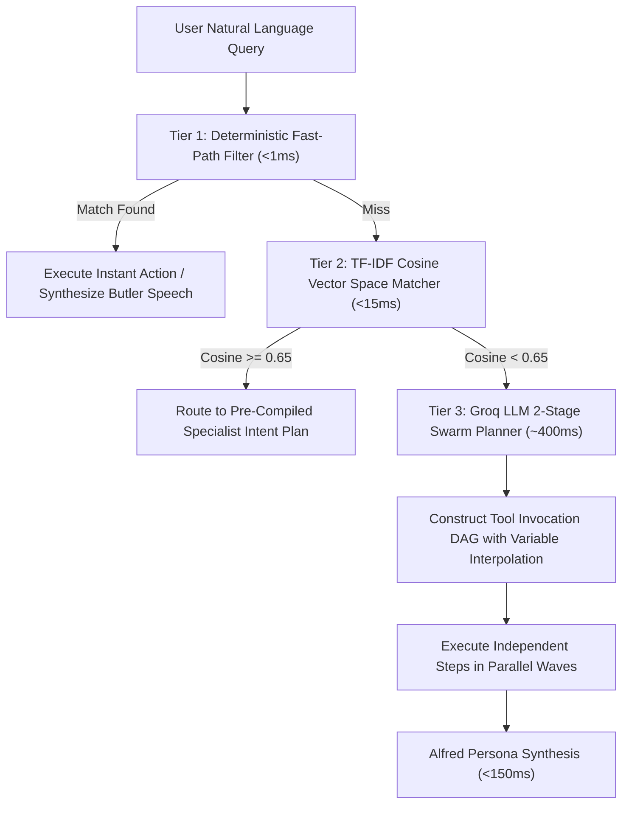

# VESPER Comprehensive Algorithms & Services Architecture

## 1. System Overview & Core Architecture

VESPER is a distributed, ambient AI desk companion and autonomous agent platform. It coordinates high-performance local hardware (Linux workstations, Nvidia GPUs, displays, camera sensors) with distributed edge nodes (Orange Pi / Raspberry Pi SBCs) and mobile companion devices (Android / iOS smartphones and tablets) into a synchronized, low-latency cognitive mesh.

```
┌───────────────────────────────────────────────────────────────────────────────────────────┐
│                                    VESPER CLUSTER TOPOLOGY                                │
├───────────────────────────────────────────────────────────────────────────────────────────┤
│                                                                                           │
│   [ Desktop HUD (Tauri v2) ]        [ Mobile Companion ]           [ Edge SBC Node ]      │
│   - React 19 + TypeScript           - Android / iOS                - Headless Linux       │
│   - MediaPipe Hand Gestures         - Notification Interceptor     - USB Mic Array (VAD)  │
│   - Glanceable Card Deck            - Mobile Screen / Camera       - Desk Speakers (Sink) │
│                │                             │                              │             │
│                └───────────────────────┬─────┴──────────────────────────────┘             │
│                                        │ WebSocket /ws (:8000)                            │
│                                        ▼                                                  │
│   ┌───────────────────────────────────────────────────────────────────────────────────┐   │
│   │                              VESPER GATEWAY (:8000)                               │   │
│   │   - Multiplexed Single-Pipe WebSocket Server                                      │   │
│   │   - Active TCP /24 Subnet Sweep & Device Discovery                                │   │
│   │   - Heartbeat Supervisor (30s interval, 90s timeout)                              │   │
│   │   - Out-of-Band Barge-in Interruption Dispatcher (<30ms)                          │   │
│   └───────────────┬───────────────────────────────────────────────────┬───────────────┘   │
│                   │ REST (Keep-Alive)                                 │ Internal / Event  │
│                   ▼                                                   ▼                   │
│   ┌───────────────────────────────┐                   ┌───────────────────────────────┐   │
│   │    AGENT SWARM CORE (:8001)   │                   │    SYNC MANAGER & CLUSTER     │   │
│   │ - Tier 1: Deterministic Filter│                   │ - Least-Capability Allocator  │   │
│   │ - Tier 2: TF-IDF Cosine Match │                   │ - Hardware Telemetry Probing  │   │
│   │ - Tier 3: Groq LLM Swarm      │                   │ - Monotonic State Versioning  │   │
│   │ - 2-Stage DAG Planner         │                   │ - State Diffs & Replication   │   │
│   │ - 12 Cognitive Specialists    │                   └───────────────────────────────┘   │
│   └───────────────┬───────────────┘                                                       │
│                   │                                                                       │
│         ┌─────────┴─────────┐                                                             │
│         ▼                   ▼                                                             │
│   ┌───────────┐       ┌───────────┐                                                       │
│   │   VOICE   │       │  VISION   │                                                       │
│   │  ENGINE   │       │  ENGINE   │                                                       │
│   │  (:8002)  │       │  (:8000)  │                                                       │
│   └───────────┘       └───────────┘                                                       │
└───────────────────────────────────────────────────────────────────────────────────────────┘
```

---

## 2. Exhaustive Services Breakdown

### 2.1 Gateway Service (`backend/gateway/`)
* **Role**: Primary multiplexing router, connection lifecycle supervisor, and state broker.
* **Port**: `8000` (HTTP and WebSocket `/ws`).
* **Concurrency Model**: Asynchronous non-blocking event loop (`FastAPI` + `uvicorn` + `asyncio`).
* **Core Responsibilities**:
  1. **Multiplexed Single-Pipe Transport**: Consolidates 8 logical channels (`CONTROL`, `VOICE`, `GESTURE`, `NOTIFY`, `SYSTEM`, `AGENT`, `SYNC`, `VISION`) over a single persistent WebSocket connection per client.
  2. **Active Heartbeat Supervisor**: Dispatches `PING` frames every 30 seconds; clients must return `PONG` within 90 seconds or be pruned.
  3. **Out-of-Band Barge-in**: Intercepts `INTERRUPT` envelopes with Priority 10; preemptively cancels running background planning tasks and dispatches audio truncation commands to speaker sinks in $<30\text{ms}$.
  4. **Active Subnet Discovery**: Probes `/24` subnets concurrently to locate edge nodes and companion devices without relying on unstable mDNS/multicast.

### 2.2 Cognitive Agent Swarm & Supervisor (`backend/agent/`)
* **Role**: High-level reasoning, query planning, intent classification, and specialist coordination.
* **Port**: `8001` (REST endpoint `POST /query`).
* **Internal Components**:
  1. **Alfred Supervisor (`alfred.py`)**: Top-level persona synthesis, conversation history sliding window, temporal grounding injection, and fast-path execution bypass.
  2. **Swarm Planner (`planner.py`)**: 2-stage planning engine that converts unstructured natural language into an executable DAG of specialist tool invocations.
  3. **Semantic Router (`semantic_router.py`)**: 3-tier routing hierarchy (Deterministic fast-path -> TF-IDF cosine similarity -> Groq LLM fallback).
  4. **12 Cognitive Specialists**:
     * `TaskSpecialist`: Calendars, reminders, today-isolated daily agenda, and todo lifecycle.
     * `MediaSpecialist`: Spotify playback, YouTube search, track controls, and volume adjustments.
     * `ResearchSpecialist`: Web search via Tavily/SerpAPI, arXiv paper summaries, and fact verification.
     * `CrawlSpecialist`: Playwright/BeautifulSoup headless web scraper with Markdown extraction.
     * `FinanceSpecialist`: Account balances, spending transactions, split bills, and peer debts.
     * `SystemSpecialist`: Host CPU/RAM vitals, process inspection, power control, and network scanning.
     * `MemorySpecialist`: Semantic knowledge retrieval and episodic memory via Shodh-Memory.
     * `VisionSpecialist`: Webcam visual inspection, document OCR transcription, and multi-monitor screen capture.
     * `EmailSpecialist`: Gmail OAuth thread search, unread digest extraction, and multi-turn email composition.
     * `GitHubSpecialist`: Repository inspection, open issues, PR reviews, and commit histories.
     * `ClockSpecialist`: Alarms, multi-timezone time conversions, and stopwatches.
     * `WeatherSpecialist`: Live weather conditions and forecasts via Open-Meteo.

### 2.3 Voice Subsystem (`backend/voice/`)
* **Role**: Wake-word perception, speech endpointing, speech-to-text, and voice synthesis.
* **Port**: `8002` (REST endpoint `POST /tts`).
* **Sub-Modules**:
  1. **WakeWordListener (`wake_word_listener.py`)**: Continuously processes 16kHz 16-bit PCM audio through `openWakeWord` with custom "Hey Alfred" acoustic embeddings.
  2. **Speech Endpointer (WebRTC VAD)**: Detects voice activity start and silence endpoints with adaptive hangover smoothing.
  3. **STT Transcriber**: Offline transcription using `faster-whisper` (Whisper Small/Medium INT8 on CPU/CUDA).
  4. **TTS Engine (`tts_service.py`)**: Kokoro TTS (82M parameter neural model producing studio-quality audio in ~120ms) with Piper TTS fallback (<80ms TTFS).

### 2.4 Vision & Gesture Engine (`backend/vision/`)
* **Role**: Touchless hand gesture classification, physical camera control, and multi-screen capture.
* **Sub-Modules**:
  1. **GestureWorker (`gesture_service.py`)**: Throttled 5–8 FPS background optical inference with MediaPipe Landmarker, candidate streak validation, and release hysteresis locks.
  2. **CameraCapture (`camera_stream.py`)**: Single-frame snapshot and MJPEG streaming engine with zero-CPU hardware release and privacy state synchronization.
  3. **ScreenCapture (`camera_stream.py`)**: Wayland-native (`grim`), Hyprland/Sway compositor output discovery, multi-monitor focus tracking, and anti-blank frame detection.
  4. **GroqVisionClient (`vllm.py`)**: Multimodal image analysis and text extraction using Llama-3.2-11B-Vision.

### 2.5 Synchronization & Cluster Manager (`backend/sync/`)
* **Role**: Multi-device topology tracking, state replication, and hardware workload allocation.
* **Port**: `8004` (HTTP profile endpoint `GET /sync/profile`).
* **Core Mechanisms**:
  1. **SyncManager (`sync_manager.py`)**: In-memory canonical cluster state snapshot (`SynchronizedState`) with monotonic version sequencing.
  2. **ClusterAllocator (`cluster_allocator.py`)**: Computes capability scores and assigns hardware roles (`PRIMARY`, `MIC_ARRAY`, `SPEAKER_NODE`, `HUD`) according to the Least-Capability Principle.
  3. **Device Probe (`device_probe.py`)**: Real-time host profiling (CPU cores, RAM total/available, GPU acceleration, camera presence, display servers).

---

## 3. Master Algorithmic Specifications

### 3.1 Gesture Perception & Hand State Machine

#### A. Landmark Geometry Classification Algorithm
When MediaPipe's statistical gesture classifier returns low confidence or `None`, the system executes heuristic landmark geometry calculations over the 21 detected 3D landmarks:

Let $L_i = (x_i, y_i, z_i)$ represent the $i$-th hand landmark, where $i \in [0, 20]$. Key landmark indices:
* Wrist: $L_0$
* Thumb: MCP $L_1$, IP $L_3$, Tip $L_4$
* Index: MCP $L_5$, PIP $L_6$, TIP $L_8$
* Middle: MCP $L_9$, PIP $L_{10}$, TIP $L_{12}$
* Ring: MCP $L_{13}$, PIP $L_{14}$, TIP $L_{16}$
* Pinky: MCP $L_{17}$, PIP $L_{18}$, TIP $L_{20}$

1. **Finger Extension Check**:
   A non-thumb finger $F$ with tip $L_{tip}$, PIP $L_{pip}$, and MCP $L_{mcp}$ is classified as **extended** if:
   $$y_{tip} < y_{pip} < y_{mcp} \quad \text{and} \quad \|L_{tip} - L_0\| > 1.3 \times \|L_{pip} - L_0\|$$
   Otherwise, it is classified as **folded**.

2. **Thumb Extension Check**:
   Thumb extension is evaluated using lateral distance from the index MCP:
   $$\|L_4 - L_5\| > 1.2 \times \|L_2 - L_5\|$$

3. **Pose Classification Logic**:
   * **`CLOSED_FIST`**: All 4 fingers folded ($E_{index} = E_{mid} = E_{ring} = E_{pinky} = \text{False}$) and thumb tucked over fingers ($y_4 > y_6$).
   * **`OPEN_PALM`**: All 5 fingers extended ($E_{thumb} = E_{index} = E_{mid} = E_{ring} = E_{pinky} = \text{True}$).
   * **`POINTING_UP`**: Index extended ($E_{index} = \text{True}$), middle/ring/pinky folded ($E_{mid} = E_{ring} = E_{pinky} = \text{False}$).
   * **`PEACE_SIGN`**: Index and middle extended ($E_{index} = E_{mid} = \text{True}$), ring and pinky folded ($E_{ring} = E_{pinky} = \text{False}$).
   * **`ROCK_ON` (`ILoveYou`)**: Index and pinky extended ($E_{index} = E_{pinky} = \text{True}$), middle and ring folded ($E_{mid} = E_{ring} = \text{False}$).

#### B. Continuous Wrist Velocity & Trajectory Algorithm
To distinguish lateral swipes (`NEXT_TRACK`, `PREV_TRACK`) from static poses:
1. Maintain a ring buffer of historical wrist positions:
   $$H = \{(t_k, x_k, y_k) \mid k = 1 \dots M\}, \quad t_M - t_1 \le 0.35\text{s}$$
2. Mirror camera X coordinates to match user physical space:
   $$x_{mirrored} = 1.0 - x$$
3. Calculate displacement vector over the time window:
   $$\Delta x = x_{mirrored, M} - x_{mirrored, 1}, \quad \Delta y = y_M - y_1, \quad \Delta t = t_M - t_1$$
4. Compute horizontal speed:
   $$v_x = \frac{|\Delta x|}{\Delta t}$$
5. **Swipe Decision Rule**:
   $$\text{Gesture} = \begin{cases}
   \text{NEXT\_TRACK} & \text{if } \Delta x > 0.06 \text{ and } |\Delta x| > 1.2 \times |\Delta y| \text{ and } v_x \ge 0.25 \\
   \text{PREV\_TRACK} & \text{if } \Delta x < -0.06 \text{ and } |\Delta x| > 1.2 \times |\Delta y| \text{ and } v_x \ge 0.25 \\
   \text{STATIC\_POSE} & \text{otherwise}
   \end{cases}$$
6. **Motion Gating**: If $v_x \ge 0.22$ or $|\Delta x| \ge 0.035$, static poses (`OPEN_PALM`, `CLOSED_FIST`) are suppressed to eliminate false triggers during arm movement.

#### C. Candidate Streak & Release Hysteresis State Machine
To guarantee zero double-triggering while allowing smooth volume ramping:
1. **Streak Filter**: A candidate gesture $G$ must be detected identically for $N \ge 2$ consecutive frames before emission:
   $$\text{Emit}(G) \iff \text{Streak}(G) \ge 2 \text{ and } \text{Confidence}(G) \ge 0.50$$
2. **Release Requirement (`_gesture_awaiting_release`)**:
   For all non-volume gestures (`CLOSED_FIST`, `PEACE_SIGN`, `POINTING_UP`, `ROCK_ON`, `AIR_TAP`):
   * Once emitted, $G$ is added to the set $S_{awaiting\_release}$.
   * While $G \in S_{awaiting\_release}$, subsequent detections of $G$ are blocked, regardless of streak count.
   * $S_{awaiting\_release}$ is cleared if and only if the detector observes neutral/no hand ($\text{Gesture} = \text{NONE}$) for $K \ge 1$ frames.
3. **Volume Continuous Exception**:
   Volume gestures (`THUMB_UP`, `THUMB_DOWN`, `VOLUME_DIAL`) bypass $S_{awaiting\_release}$, permitting continuous adjustments throttled at 0.35s intervals.
4. **Deliberate Hold State Machine (Rock On Lock)**:
   * When `ROCK_ON` is detected, initiate hold timer $t_{start} = \text{now}()$.
   * If held continuously for $\Delta t \ge 1.0\text{s}$, fire `GESTURE_TOGGLE:PAUSED` (or `:RESUMED`).
   * Enter a 2.5s lockout window ($t_{lockout} = \text{now}() + 2.5\text{s}$) to prevent state oscillation.

#### D. Analog Volume Dial Tracking
When thumb tip $L_4$ and index tip $L_8$ pinch together ($\|L_4 - L_8\| \le 0.05$ normalized distance):
1. Compute orientation angle $\theta$ of the vector from wrist $L_0$ to index knuckle $L_5$:
   $$\theta = \text{atan2}(y_5 - y_0, x_5 - x_0) \times \frac{180}{\pi}$$
2. Map $\theta \in [10^\circ, 170^\circ]$ linearly to volume percentage:
   $$\text{Volume} = \text{clamp}\left(\left\lfloor \frac{\theta - 10^\circ}{160^\circ} \times 100 \right\rfloor, 0, 100\right)$$
3. If $\text{Volume} \neq \text{Volume}_{last}$, emit `SET_VOLUME` with the calculated integer value.

---

### 3.2 Vision & Multi-Monitor Screen Perception

#### A. Compositor Display Discovery Algorithm
Under Linux Wayland and X11, display topologies vary significantly. `ScreenCapture.list_monitors()` discovers physical monitors dynamically:
1. **Wayland Compositor Query**:
   * If `XDG_SESSION_TYPE=wayland` and `hyprctl` is present: executes `hyprctl -j monitors` and parses JSON output for output names (`DP-3`, `eDP-1`), resolutions, geometry offsets $(x, y)$, and active window/workspace focus (`focused: bool`).
   * If `swaymsg` is present: executes `swaymsg -t get_outputs`.
2. **X11 Query**:
   * Runs `xrandr --listmonitors` and parses connected display geometry.
3. **Cross-Platform Fallback**:
   * Uses `mss.mss().monitors` for Windows/macOS.

#### B. Anti-Blank Frame Detection Algorithm
Wayland isolates native compositor framebuffers from XWayland clients. Standard X11 capture calls return solid black images without raising exceptions.
1. Given captured PIL Image $I$:
2. Extract channel extrema:
   $$E = I.\text{getextrema}() = [(\min_R, \max_R), (\min_G, \max_G), (\min_B, \max_B)]$$
3. Evaluate blank condition:
   $$\text{IsBlank}(I) = \begin{cases}
   \text{True} & \text{if } \max_R \le 1 \text{ and } \max_G \le 1 \text{ and } \max_B \le 1 \\
   \text{False} & \text{otherwise}
   \end{cases}$$
4. **Execution Hierarchy**:
   If a provider produces a blank frame or raises an exception, the capture pipeline cascades through:
   $$\text{Wayland Native } (grim) \longrightarrow \text{KDE } (spectacle) \longrightarrow \text{GNOME } (gnome\text{-}screenshot) \longrightarrow mss \longrightarrow \text{PIL } ImageGrab \longrightarrow \text{ImageMagick } import$$

#### C. Multi-Monitor Targeting Modes
* **Focused Display Auto-Targeting (`monitor_index=None`)**: Selects the monitor where `is_focused == True`. Alfred automatically reads the display the user is currently working on.
* **Panoramic Desktop Canvas (`monitor_index=0`)**: Captures all displays combined (e.g. $4480 \times 1440$) for cross-screen desktop queries.
* **Named Output Targeting (`monitor_name="DP-3"` / `"external"` / `"laptop"`)**: Resolves semantic aliases to hardware outputs.

---

### 3.3 3-Tier Semantic Routing & Cognitive Execution



#### A. Tier 1: Deterministic Fast-Path Filter
* **Latency**: $<1.0\text{ms}$ (0 Groq API tokens consumed).
* **Mechanism**: Exact regex and substring matching against system status patterns (`"system status"`, `"cluster status"`, `"vitals"`, `"what day is today"`, `"current time"`, `"who made you"`).
* **Guarantees**: Complete immunity to cloud LLM rate limits and API key rotation delays.

#### B. Tier 2: TF-IDF Vector Space Intent Matcher
* **Latency**: $<15\text{ms}$ on CPU.
* **Mechanism**: Computes sparse TF-IDF vectors for the query and compares against calibrated domain prototypes:
  $$\text{sim}(Q, P) = \frac{\vec{V}_Q \cdot \vec{V}_P}{\|\vec{V}_Q\| \|\vec{V}_P\|}$$
* If $\max_P \text{sim}(Q, P) \ge 0.65$, routes directly to the identified specialist with zero cloud token consumption.

#### C. Tier 3: Groq LLM 2-Stage Swarm Planner
* **Stage 1 (Tool Selection & DAG Construction)**:
  * Generates an optimal execution plan consisting of specialist tool calls:
    $$P = [S_1, S_2, \dots, S_K]$$
  * Each step $S_i$ declares its tool name, parameters, and dependency array:
    $$\text{deps}(S_i) \subseteq \{S_1, \dots, S_{i-1}\}$$
* **Variable Interpolation**:
  If $S_i$ requires the output of an earlier step $S_j$ ($j < i$), parameter templates express dynamic references:
  $$\text{param} = "\$prev\_step.track\_id" \quad \text{or} \quad "\$step\_1.sender\_email"$$
  Before executing $S_i$, the runtime resolves dynamic references against the structured results in the execution context.
* **Topological Wave Execution**:
  Steps with zero mutual dependencies are executed concurrently via `asyncio.gather()`, collapsing sequential latency.

---

### 3.4 Temporal Grounding & Task Isolation Algorithm

To prevent past backlog tasks from being reported as today's schedule:
1. **Dynamic Reference Timestamp Injection**:
   Every prompt receives the exact host reference time:
   $$T_{ref} = \text{datetime.now(local\_tz)}$$
   Formatted as `Saturday, September 05, 2026, 07:16 PM IST`.
2. **Date Window Definition**:
   For query date $D$ (default: today), define:
   $$T_{min} = \text{start\_of\_day}(D), \quad T_{max} = \text{end\_of\_day}(D)$$
3. **4-Tier Task Partitioning**:
   For each task $T$ with creation time $T_{created}$ and optional deadline $T_{deadline}$:
   $$\text{Class}(T) = \begin{cases}
   \text{SCHEDULED} & \text{if } T_{deadline} \text{ exists and } T_{min} \le T_{deadline} \le T_{max} \\
   \text{CREATED\_TODAY} & \text{if } T_{deadline} \text{ is None and } T_{min} \le T_{created} \le T_{max} \\
   \text{OVERDUE} & \text{if } T_{deadline} \text{ exists and } T_{deadline} < T_{min} \text{ and not } T_{completed} \\
   \text{BACKLOG} & \text{if } T_{deadline} \text{ is None and } T_{created} < T_{min} \text{ and not } T_{completed}
   \end{cases}$$
4. **Synthesis Rule**:
   The daily agenda presents $\text{SCHEDULED} \cup \text{CREATED\_TODAY}$ as today's active commitments. $\text{OVERDUE}$ and $\text{BACKLOG}$ items are aggregated into separate count summaries without cluttering today's schedule.

---

### 3.5 Distributed Cluster Hardware Allocation

#### A. Least-Capability Principle
Heavy compute tasks (LLM planning, multimodal vision) run on high-power workstations. Lightweight sensory tasks (wake-word listening, audio output) run on dedicated edge nodes (Orange Pi) to keep workstations cool and silent.

#### B. Capability Score Formula
For every discovered node $D$ in `active_devices`:
$$\text{CapScore}(D) = (\text{RAM}_{total} \times 2.0) + (\text{RAM}_{avail} \times 3.0) + (\text{Cores} \times 1.5) + \text{Weight}_{type}$$
Where:
* $\text{Weight}(\text{desktop}) = 10.0$
* $\text{Weight}(\text{orange\_pi}) = 2.0$
* $\text{Weight}(\text{mobile\_android} / \text{mobile\_ios}) = 1.0$
* $\text{Weight}(\text{headless\_server}) = 5.0$

#### C. Dynamic Role Election
1. **`PRIMARY_COORDINATOR`**: Assigned to $\arg\max_D \text{CapScore}(D)$ with $\text{RAM}_{avail} \ge 2.0\text{GB}$.
2. **`ROLE_AUDIO_CAPTURE` (Microphone)**: Assigned to the device with an active mic array having the **lowest** capability score ($\arg\min_{D \in \text{Mics}} \text{CapScore}(D)$), keeping high-power nodes idle.
3. **`ROLE_AUDIO_PLAYBACK` (Speaker)**: Assigned to the node connected to physical room speakers. Automatically fails over to the primary workstation if the edge node disconnects.
4. **`ROLE_VISION_PERCEPTION`**: Assigned to the node with the camera sensor pointed at the user.

---

## 4. End-to-End Communication Protocol

### 4.1 Master Frame Envelopes (`backend/shared/events.py`)

All communication over WebSocket `/ws` uses the strict JSON schema:

#### Client-to-Server Envelope (`ClientEnvelope`)
```json
{
  "uuid": "f47ac10b-58cc-4372-a567-0e02b2c3d479",
  "channel": "GESTURE",
  "type": "GESTURE_EVENT",
  "timestamp": 1788648120.450,
  "payload": {
    "gesture": "CLOSED_FIST",
    "confidence": 0.96,
    "source": "DESK_HUD"
  }
}
```

#### Server-to-Client Envelope (`ServerEnvelope`)
```json
{
  "uuid": "8b3a1a9e-64d2-4ef8-921c-34d2847a98b1",
  "channel": "SYSTEM",
  "type": "SET_VOLUME",
  "status": "ok",
  "timestamp": 1788648120.455,
  "payload": {
    "volume": 0,
    "muted": true,
    "media_action": "pause"
  }
}
```

---

### 4.2 Multiplexed Channels & Event Types Catalog

| Channel | Event Type | Emitter | Description |
| :--- | :--- | :--- | :--- |
| **`CONTROL`** | `CLIENT_HELLO` | Client | Initial client handshake declaring client ID, type, and capabilities |
| | `SERVER_HELLO` | Gateway | Handshake response assigning session ID and delivering initial state |
| | `PING` / `PONG` | Both | 30-second heartbeat liveness probe |
| | `ERROR` | Gateway | Error diagnostics and protocol violation notices |
| **`VOICE`** | `WAKE_WORD_DETECTED` | Edge/Host | Emitted when "Hey Alfred" acoustic model threshold is crossed |
| | `WAKE_WORD_TOGGLE` | Client | Request to pause or resume wake-word acoustic listening |
| | `WAKE_WORD_STATE` | Gateway | Broadcast indicating whether wake-word listener is ARMED or MUTED |
| | `VOICE_COMMAND` | Client | Transcribed user voice query text |
| | `VOICE_AUDIO_CHUNK` | Gateway | Raw 16-bit 22050Hz PCM audio stream to speaker sink |
| | `AGENT_SPEAKING` | Gateway | Broadcast when Alfred begins voice audio synthesis |
| | `AGENT_IDLE` | Gateway | Broadcast when voice playback concludes and cluster returns to idle |
| **`AGENT`** | `AGENT_ACTIVATING` | Gateway | Signals that Alfred has started cognitive processing (State: THINKING) |
| | `AGENT_RESPONSE` | Gateway | Delivers speech text, Markdown output, and glanceable HUD cards |
| **`GESTURE`** | `GESTURE_EVENT` | Client/Vision | Touchless gesture trigger (`CLOSED_FIST`, `OPEN_PALM`, `VOLUME_DIAL:x`) |
| | `GESTURE_TOGGLE` | Client/Vision | Lock/unlock tracking toggle (`:PAUSED`, `:RESUMED`) |
| **`SYSTEM`** | `SET_VOLUME` | Gateway | System master volume modification request and broadcast |
| | `ZEN_MODE_STATE` | Gateway | Ambient distraction-free Zen mode state toggle |
| | `FOCUS_MODE_STATE` | Gateway | High-productivity Focus mode state toggle |
| | `MEDIA_CONTROL` | Gateway | Media actions (`play`, `pause`, `next`, `previous`) |
| | `INTERRUPT` | Client/Edge | Priority 10 out-of-band barge-in request |
| | `INTERRUPT_ACK` | Gateway | Acknowledgment confirming audio truncation and task cancellation |
| **`NOTIFY`** | `NOTIFICATION_RELAY` | Mobile | Intercepted mobile notification forwarded to Gateway |
| | `NOTIFICATION_DIGEST` | Gateway | Synthesized priority summary of pending mobile alerts |
| **`SYNC`** | `DEVICE_REGISTER` | Node | Device capability and hardware profile enrollment |
| | `DEVICE_HEARTBEAT` | Node | Periodic node keep-alive heartbeat |
| | `STATE_SYNC` | Gateway | Monotonic state diff broadcast |
| | `STATE_SNAPSHOT` | Gateway | Full cluster state snapshot |
| **`VISION`** | `SCREEN_CAPTURE_REQUEST` | Gateway | Asks client (desktop or phone) to grab current screen frame |
| | `SCREEN_CAPTURE_RESPONSE`| Client | Returns base64 encoded JPEG screen image to Gateway |
| | `CAMERA_FRAME_STREAM` | Client | Streams video frames from mobile camera to Gateway |

---

## 5. Client Application Implementation Guide

### 5.1 Desktop HUD (Tauri v2 + React 19 + TypeScript)

#### Directory Structure
* `desktop/src/App.tsx`: Main HUD glassmorphic card deck and layout.
* `desktop/src/components/CameraDrawer.tsx`: Vision stream view, gesture badge, wake word button, and safety lock.
* `desktop/src/services/camera.ts`: MediaPipe vision task manager, discrete snapshot loop, and landmark geometry fallback.
* `desktop/src/services/gateway.ts`: WebSocket client managing `/ws` channel subscriptions.

#### Key Implementation Details:
1. **Camera Feed & MJPEG**:
   ```tsx
   
   ```
   Do not set `crossOrigin="anonymous"` on the stream tag in WebKitGTK; standard tags avoid preflight security locks.
2. **MediaPipe Frame Processing**:
   Fetch discrete frames from `/api/camera/snapshot`:
   ```typescript
   const res = await fetch("http://127.0.0.1:8000/api/camera/snapshot");
   const blob = await res.blob();
   const bitmap = await createImageBitmap(blob);
   ```
   Run WebGL2 canvas context on the main thread using UMD `vision_wasm_internal.js` to ensure stability on Linux WebKitGTK.

---

### 5.2 Mobile Companion (Android Kotlin / iOS Swift)

#### Android Architecture:
1. **Notification Interception (`NotificationListenerService`)**:
   ```kotlin
   class VesperNotificationService : NotificationListenerService() {
       override fun onNotificationPosted(sbn: StatusBarNotification) {
           val extras = sbn.notification.extras
           val title = extras.getString(Notification.EXTRA_TITLE) ?: ""
           val text = extras.getCharSequence(Notification.EXTRA_TEXT)?.toString() ?: ""
           val pkg = sbn.packageName
           
           VesperGatewayClient.sendEnvelope(
               channel = "NOTIFY",
               type = "NOTIFICATION_RELAY",
               payload = mapOf(
                   "package_name" to pkg,
                   "title" to title,
                   "text" to text,
                   "post_time" to System.currentTimeMillis() / 1000.0
               )
           )
       }
   }
   ```
2. **Screen Capture Provider (MediaProjection API)**:
   When `SCREEN_CAPTURE_REQUEST` arrives on `Channel.VISION`, capture the VirtualDisplay surface, compress to JPEG base64, and transmit `SCREEN_CAPTURE_RESPONSE`.
3. **Foreground Service**:
   Maintains a persistent background WebSocket link with `START_STICKY` and a high-priority ongoing notification.

---

### 5.3 Edge SBC Node (Orange Pi / Raspberry Pi)

#### Architecture:
1. **Service Runner**: Executes `scripts/run_vesper_services.py --mode edge_sbc` via `systemd`.
2. **Acoustic Wake-Word Loop**:
   Runs `openWakeWord` with 16kHz PCM chunks:
   ```python
   audio_chunk = stream.read(1280, exception_on_overflow=False)
   prediction = model.predict(audio_chunk)
   if prediction["hey_alfred"] >= 0.50:
       await gateway_client.send_envelope(Channel.VOICE, EventType.WAKE_WORD_DETECTED)
   ```
3. **Speaker Sink**:
   Subscribes to `Channel.VOICE` for `VOICE_AUDIO_CHUNK` and streams directly to ALSA default device.

---

## 6. Verification & Architectural Integrity

Every algorithm and communication mechanism is verified by automated test suites:
* `backend/tests/test_vision.py`: 14 tests verifying Wayland multi-monitor detection, blank frame rejection, Groq multimodal reasoning, candidate streak filtering, and release hysteresis locks.
* `backend/tests/test_gateway.py`: 11 tests verifying channel multiplexing, handshake validation, out-of-band barge-in truncation, and event broadcasts.
* `backend/tests/test_agent.py`: 26 tests verifying 3-tier routing, 2-stage planning DAGs, variable interpolation, and conversation context.
* `backend/tests/test_cluster_allocator.py`: 6 tests verifying capability scoring and role allocation.
* `backend/tests/test_camera_route_and_normalizer.py`: 4 tests verifying temporal grounding and snapshot encoding.
