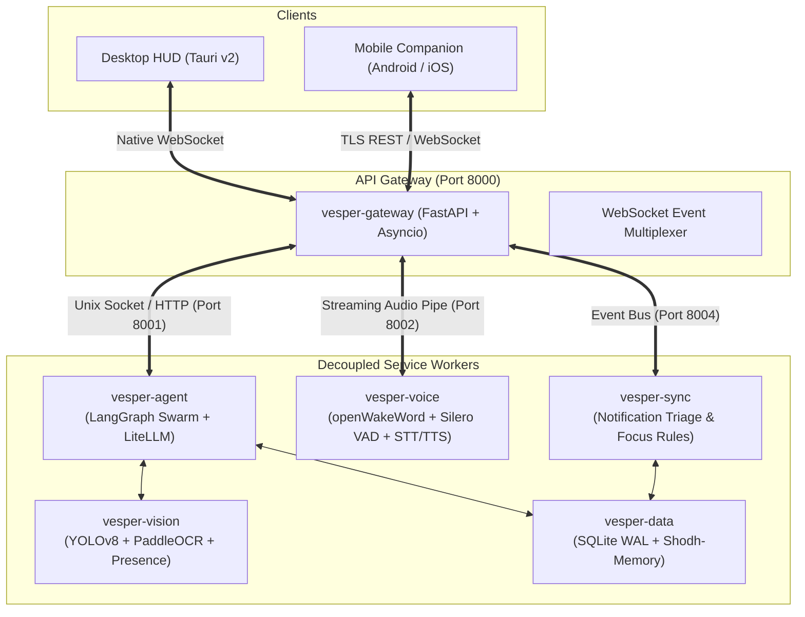

# VESPER: Decoupled Backend & Multi-Agent Swarm Architecture

This document defines the technical architecture for the **VESPER** backend, detailing the decoupled microservice design, inter-process communication (IPC), hardware portability (including Orange Pi / PC hybrid setups), and the **Multi-Agent Swarm** cognitive pipeline.

---

## 1. Core Architectural Tenets

1. **Strict Process Decoupling**: Heavy native libraries (PyTorch, PaddleOCR, Llama.cpp) and audio hardware loops are strictly isolated from the core API gateway. A failure or crash in one worker never terminates the gateway, clock, or ambient display.
2. **Distributed Hardware Flexibility**: All services communicate over standard async protocols (Unix Domain Sockets or HTTP/WebSockets). Services can run together on a single development machine, or be dynamically split across hardware (e.g., lightweight services on an Orange Pi desk unit, heavy vision/LLMs on a home PC).
3. **Bifurcated Execution & Zero Agent Chitchat**: Simple system controls execute in <50ms without invoking an LLM. Domain queries are dispatched to specialized swarm agents running concurrently in parallel (`asyncio.gather()`), returning structured JSON directly to Alfred without recursive multi-agent ping-pong.

---

## 2. Microservice Topology



### Microservice Directory & Roles

| Service | Port / Socket | Primary Technology | Responsibility |
| :--- | :--- | :--- | :--- |
| **`vesper-gateway`** | `8000` / `/tmp/vesper_gw.sock` | FastAPI, Uvicorn, WebSockets | Client connection management, message envelope multiplexing, audio stream routing. Strictly zero ML/AI dependencies. |
| **`vesper-agent`** | `8001` / `/tmp/vesper_agent.sock` | LangGraph, LiteLLM, Pydantic | Cognitive swarm supervisor ("Alfred"), specialist agent delegation, tool routing. |
| **`vesper-voice`** | `8002` / `/tmp/vesper_voice.sock` | openWakeWord, Silero VAD, Groq/Whisper, Piper/Cartesia | Continuous audio hardware stream, "Alfred" wake word spotting, barge-in interrupt detection, audio synthesis. |
| **`vesper-vision`** | `8003` / `/tmp/vesper_vision.sock` | Ultralytics YOLOv8, PaddleOCR, OpenCV | On-demand document OCR, desk object recognition, and low-power presence detection. |
| **`vesper-sync`** | `8004` / `/tmp/vesper_sync.sock` | FastAPI, Pydantic | Mobile companion notification ingestion, priority filtering, and focus-mode rules. |
| **`vesper-data`** | Shared Lib / Subservice | SQLite (WAL mode), aiosqlite | Relational storage for Tasks, Finance Ledger, Debts, and Shodh-Memory episodic records. |

---

## 3. Hardware Deployment & Orange Pi Portability

Because all inter-service boundaries use environment-driven service discovery (`AGENT_SERVICE_URL`, `VISION_SERVICE_URL`), the system seamlessly adapts to multiple physical deployment topologies without code changes:

### Topology A: All-in-One (Development on Host PC)
* All services run locally on your host machine (`mihir-arch`, Intel Core i5-12500H).
* Communication runs over high-speed **Unix Domain Sockets** (`/tmp/vesper/*.sock`), yielding sub-millisecond IPC latency with zero TCP/IP stack overhead.

### Topology B: Orange Pi Standalone Appliance (Cloud-Accelerated)
* The Orange Pi (even a 1GB RAM board like the Orange Pi PC Plus) hosts:
  * `vesper-gateway` (~45MB RAM)
  * `vesper-agent` (~50MB RAM, calling cloud Groq Llama-3.3-70B via LiteLLM)
  * `vesper-voice` (~60MB RAM, openWakeWord + Groq Whisper)
  * `vesper-data` (~25MB RAM, local SQLite WAL)
* **Total Memory Footprint**: ~180MB RAM. Operates 24/7 on your desk with the user's laptop powered off.

### Topology C: Hybrid (Orange Pi Desk Companion + PC Heavy Worker)
* Orange Pi runs the physical desk interface (Gateway, Screen, Microphone, Audio Output, Rotary controls).
* When a vision query or heavy local model is requested, the Orange Pi forwards the payload over your home LAN to `http://<laptop-ip>:8003` where the PC executes YOLOv8/PaddleOCR and returns the result.

---

## 4. The Multi-Agent Swarm (AI Flow)

Instead of a monolithic sequential graph, VESPER uses a **Hierarchical Swarm Architecture**:

```mermaid
graph TB
    Input["User Query (Voice / Text)"] --> Alfred["👑 Alfred (Supervisor & Persona Orchestrator)"]

    subgraph FastPath ["⚡ Fast Path (<50ms - No LLM)"]
        SysExec["Native Execution (Volume / Mute / Zen Mode)"]
    end

    subgraph SpecialistSwarm ["🐝 Specialist Sub-Agent Swarm"]
        Media["🎵 MediaAgent<br/>Tools: Spotify Web API, Playlists, YouTube"]
        Finance["💰 FinanceAgent<br/>Tools: Accounts, Transactions, Debts, Summaries"]
        Tasks["📅 TaskAgent<br/>Tools: Task CRUD, Deadlines, Google Calendar v3"]
        Research["🔍 ResearchAgent<br/>Tools: Tavily Search, Crawl4AI Scraper"]
        Vision["👁️ VisionAgent<br/>Tools: YOLOv8 Detect, PaddleOCR, VLM"]
    end

    subgraph ProactiveSwarm ["⏰ Proactive Background Swarm"]
        Triage["🛡️ TriageAgent<br/>Event: Phone Notification Ingestion & Filter"]
        Presence["👤 PresenceAgent<br/>Event: Camera Desk Arrival / Departure"]
    end

    Alfred -->|Match Regex / Direct Command| SysExec
    Alfred -->|Single Domain Query| SpecialistSwarm
    Alfred -.->|Multi-Intent Parallel Dispatch (asyncio.gather)| Media
    Alfred -.->|Multi-Intent Parallel Dispatch| Tasks
    Alfred -.->|Multi-Intent Parallel Dispatch| Finance

    ProactiveSwarm -.->|Priority Interrupt / Ambient Alert| Gateway["API Gateway"]
    Gateway --> Alfred

    SpecialistSwarm -->|Structured JSON Results| Alfred
    Alfred -->|Persona Gating (Dry, Witty Butler)| FinalResponse["Audio Output & HUD Card Payload"]
```

---

## 5. Swarm Agent Specifications

### 1. 👑 Alfred (Supervisor & Personality Orchestrator)
* **Input**: User command text + multimodal metadata (presence, current time, active focus mode).
* **Execution Logic**:
  1. **Fast-Path Check**: Direct pattern match for deterministic commands (`volume up/down`, `pause/play`, `zen mode`). Bypasses all LLMs.
  2. **Intent Classification & Decomposition**: Identifies single or compound tasks.
  3. **Concurrent Dispatch**: Spawns sub-agents concurrently via `asyncio.gather()`.
  4. **Persona Synthesis**: Receives structured JSON from workers and drafts the final spoken response.
* **Persona Rules**:
  * British butler persona: dry, witty, efficient, understated.
  * **Context Gating**: Warm and dryly humorous for casual banter; strictly terse, flat, and concise for financial numbers, emergency alerts, or during **Focus Mode**.

### 2. 🎵 `MediaAgent` (The Resident DJ)
* **Domain**: Spotify Web API & local media playback.
* **Tools**: `play_track(query)`, `pause()`, `next()`, `queue(track)`, `transfer_playback(device)`, `get_recommendation(mood)`.
* **Latency Goal**: <300ms.
* **Specialized Knowledge**: Spotify playlist IDs, music genres, mood mapping.

### 3. 💰 `FinanceAgent` (Private Ledger Master)
* **Domain**: Personal double-entry bookkeeping, expense logging, peer debt settlement.
* **Tools**: `log_expense(amount, category, account, note)`, `log_income()`, `transfer_funds()`, `get_balances()`, `record_debt(person, amount, direction)`, `settle_debt()`, `spending_summary(period)`.
* **Rules**: Zero conversational filler. Enforces mathematical precision, Indian Rupee (₹) denomination, and account integrity across Union Bank, SBI, Saraswat, and Cash.

### 4. 📅 `TaskAgent` (Chief of Staff)
* **Domain**: Todo items, deadlines, schedule coordination.
* **Tools**: `add_task(title, deadline)`, `list_pending_tasks()`, `complete_task(id)`, `delete_task(id)`, `get_upcoming_calendar_events(hours)`.
* **Sync**: Automatically syncs bidirectional updates to SQLite for mobile companion reconciliation.

### 5. 🔍 `ResearchAgent` (Deep Diver - Slow Path)
* **Domain**: External knowledge, live news, web research.
* **Tools**: `tavily_search(query)`, `crawl_page(url)`.
* **Behavior**: Runs as an asynchronous background worker. Extracts clean markdown, filters advertising junk, and distills complex findings into 2–3 spoken sentences.

### 6. 👁️ `VisionAgent` (Desk Scanner)
* **Domain**: Physical desk environment and document OCR.
* **Tools**: `detect_objects(image)`, `read_document_text(image)`, `inspect_scene_vlm(image, prompt)`.
* **Behavior**: Executed on-demand when the user gestures or asks *"Read this document"* or *"What's on my desk?"*.

---

## 6. Proactive Background Agents

A stationary desk companion must act autonomously when appropriate:

### 🛡️ `TriageAgent` (The Focus Sentry)
* Constantly monitors incoming notification streams relayed from the companion mobile app.
* **Triage Rules**:
  * *Low / Bulk (Promotions, social media, non-urgent group chats)*: Increments the silent HUD badge counter. No audio interruption.
  * *Heads-Down / Focus Mode*: Suppresses all alerts except pre-configured VIP contacts (e.g. Manager, Family).
  * *Critical Alert*: Surfaces an immediate glowing HUD card and prompts Alfred to notify: *"Pardon the intrusion, sir, but an urgent message has arrived from your team."*

### 👤 `PresenceAgent` (Desk Sentinel)
* Inspects camera frames at low frequency (1 frame every 3–5 seconds) to detect human presence at the desk.
* **Actions**:
  * *User Departs*: HUD transitions to low-power ambient clock or display sleep; active media can auto-pause.
  * *User Returns*: Display wakes up instantly, presenting a concise summary: current time, next scheduled meeting, and pending task count.

---

## 7. Multi-Intent Parallel Execution Example

User Command:
> *"Alfred, play some lofi, add 'Deploy backend' to my tasks, and what's my total bank balance?"*

### Execution Trace:
1. **Gateway** receives voice transcript, forwards to `vesper-agent`.
2. **Alfred Router** classifies 3 independent domain intents in one fast JSON turn:
   ```json
   {
     "tasks": [
       {"agent": "media", "action": "play", "params": {"query": "lofi"}},
       {"agent": "tasks", "action": "add", "params": {"title": "Deploy backend"}},
       {"agent": "finance", "action": "balance", "params": {}}
     ]
   }
   ```
3. **Concurrent Execution**:
   ```python
   media_res, task_res, finance_res = await asyncio.gather(
       media_agent.execute(tasks[0]),
       task_agent.execute(tasks[1]),
       finance_agent.execute(tasks[2])
   )
   ```
4. **Structured Results**:
   * `MediaAgent` ➔ `{"status": "playing", "track": "Lofi Hip Hop Beats"}`
   * `TaskAgent` ➔ `{"status": "created", "task_id": 42}`
   * `FinanceAgent` ➔ `{"status": "success", "total_inr": 48500}`
5. **Alfred Synthesis**:
   > *"Lofi is playing, 'Deploy backend' is on your list, and your combined balance stands at ₹48,500."*
6. **Total Latency**: **~650ms** (compared to 6–10s in ReflectOS v1 sequential chaining).

---

## 8. Anti-Latency & Anti-Bloat Safeguards

To prevent the common pitfalls of multi-agent systems:

1. **No Agent-to-Agent Chatter**: Sub-agents never talk to each other directly. They only execute their scoped tool and return structured Pydantic JSON to Alfred.
2. **Strict Tool Scoping**: Each specialist agent has access to a maximum of 4–6 tools. Tool definition schemas in LLM prompts are tiny, preventing attention dilution and hallucinations.
3. **Bounded Working Memory**: Working conversation state in LangGraph is restricted to a **sliding window of the last 10–15 messages**. Long-term recall is handled algorithmically via **Shodh-Memory** without bloating prompt tokens.
