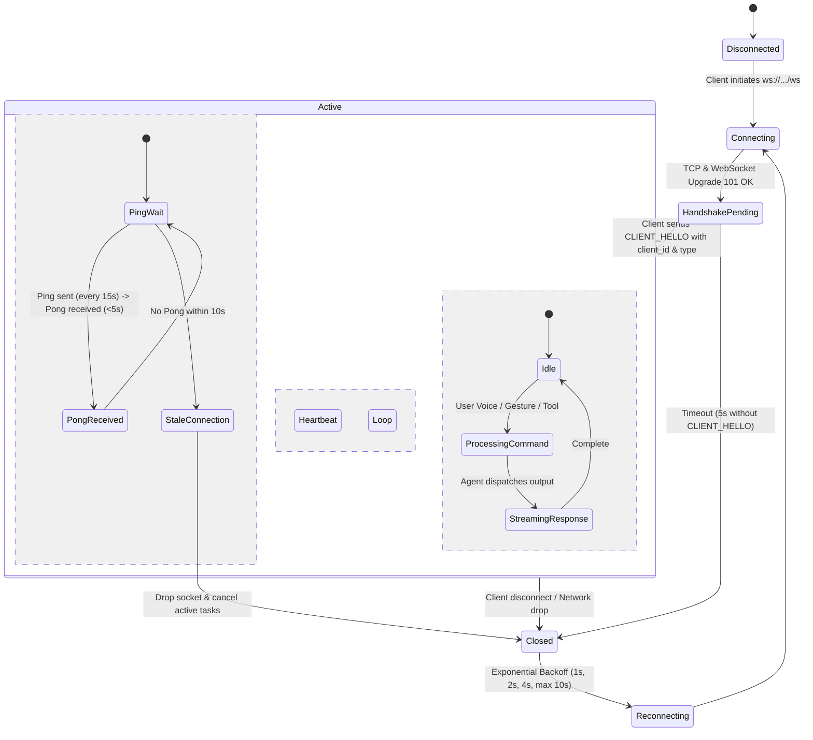
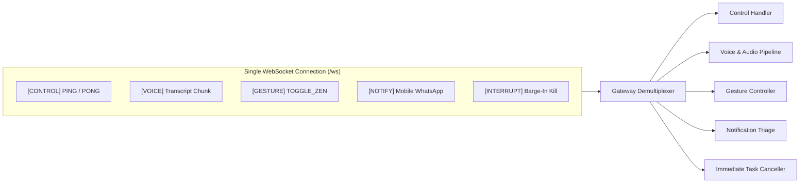
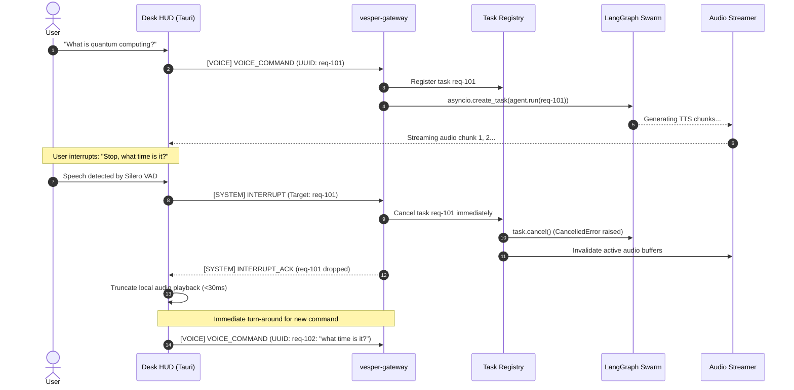

# VESPER: Backend Networking, Multiplexing & Connection Architecture

This specification details the low-level networking, WebSocket connection management, channel multiplexing, and task concurrency model for the **VESPER** backend. 

---

## 1. Architectural Philosophy: The Multiplexed WebSocket Model

ReflectOS v1 suffered from socket disconnections, thread deadlocks, and high latency because communication was fragmented across ad-hoc HTTP endpoints and a fragile Eventlet-monkeypatched Socket.IO server.

In VESPER, all client-to-backend communication is unified over a single **persistent, full-duplex WebSocket connection (`/ws`)** powered by **FastAPI + Uvicorn (`uvloop`)**.

### Why Single-Pipe Multiplexing?
1. **Zero Connection Handshake Overhead**: Audio, gestures, system volume, notifications, and UI state updates travel across an already-established connection.
2. **Deterministic Packet Ordering**: Events on the same channel maintain strict temporal ordering.
3. **Out-of-Band Instant Interrupts**: When a user speaks or gestures during audio output, an `INTERRUPT` frame bypasses queued responses and terminates running backend tasks in **<30ms**.
4. **Low Resource Footprint**: A single persistent TCP socket per client uses negligible OS file descriptors and RAM (~50KB per connection).

---

## 2. Connection Lifecycle & State Machine



### 2.1 The Handshake Protocol (`CLIENT_HELLO`)
Immediately upon establishing the raw WebSocket connection, the client must transmit a `CLIENT_HELLO` packet within 5.0 seconds, or the gateway terminates the connection:

```json
{
  "uuid": "init-89f4b-1234",
  "type": "CLIENT_HELLO",
  "channel": "CONTROL",
  "timestamp": 1725350400.123,
  "payload": {
    "client_id": "desk-hud-01",
    "client_type": "DESK_HUD",
    "version": "2.0.0",
    "capabilities": ["audio_stream", "gestures", "screen_display"]
  }
}
```

The Gateway validates the payload, registers the client in the **Connection Pool**, and responds with `SERVER_HELLO`:

```json
{
  "uuid": "init-89f4b-1234",
  "type": "SERVER_HELLO",
  "channel": "CONTROL",
  "timestamp": 1725350400.145,
  "payload": {
    "status": "authenticated",
    "session_id": "sess_89f4b_desk01",
    "heartbeat_interval_ms": 15000,
    "server_version": "2.0.0"
  }
}
```

### 2.2 Heartbeats & Dead Client Eviction
* **Interval**: Every **15 seconds**, the Gateway emits a lightweight `PING` frame.
* **Response**: The client must reply with a `PONG` within **5 seconds**.
* **Eviction**: If two consecutive heartbeats fail (or 30s elapse with zero socket activity), the Gateway marks the client as `DEAD`, closes the socket, cleans up running `asyncio.Task` handles, and logs an eviction event.

---

## 3. Channel Multiplexing Protocol

Every message flowing over the WebSocket is wrapped in a strict **Universal Envelope**:

```
┌─────────────────────────────────────────────────────────────┐
│                 VESPER UNIVERSAL ENVELOPE                   │
├───────────────┬─────────────────────────────────────────────┤
│ uuid          │ UUIDv4 Correlation ID (Pairs Req -> Resp)    │
│ channel       │ CONTROL | VOICE | GESTURE | NOTIFY | SYSTEM │
│ type          │ Specific Action / Event Identifier          │
│ timestamp     │ Unix Epoch Float (seconds.microseconds)     │
│ payload       │ Typed Object / Dictionary                   │
└───────────────┴─────────────────────────────────────────────┘
```



### Channel Definitions & Message Types

| Channel | Event Type (`type`) | Direction | Payload Description |
| :--- | :--- | :---: | :--- |
| `CONTROL` | `CLIENT_HELLO` | C -> S | Client identity, capabilities, authentication. |
| `CONTROL` | `SERVER_HELLO` | S -> C | Session establishment, heartbeat parameters. |
| `CONTROL` | `PING` / `PONG` | Both | Keep-alive liveness checks. |
| `VOICE` | `VOICE_COMMAND` | C -> S | Final or interim speech transcript from client/openWakeWord. |
| `VOICE` | `VOICE_AUDIO_CHUNK` | Both | Binary or base64 PCM/MP3 streaming audio slice. |
| `VOICE` | `AGENT_RESPONSE` | S -> C | Spoken text, synthesized audio status, UI card payload. |
| `GESTURE` | `GESTURE_EVENT` | C -> S | Discrete shortcut (`TOGGLE_ZEN`, `MUTE`, `VOLUME_DIAL:65`). |
| `NOTIFY` | `NOTIFICATION_RELAY`| C -> S | Mobile companion push notification (app, title, body, priority). |
| `NOTIFY` | `NOTIFICATION_DIGEST`| S -> C | Aggregated count and triage card for ambient HUD display. |
| `SYSTEM` | `SET_VOLUME` | Both | Master audio volume adjustment (0–100). |
| `SYSTEM` | `ZEN_MODE_STATE` | Both | Boolean toggle for minimal ambient display. |
| `SYSTEM` | `FOCUS_MODE_STATE`| Both | Boolean toggle suppressing non-critical alerts. |
| **`SYSTEM`** | **`INTERRUPT`** | **Both** | **High-priority out-of-band kill signal (Barge-in).** |

---

## 4. Concurrency Model & Instant Barge-in Cancellation

ReflectOS v1 crashed because long AI calls and audio operations were run synchronously, blocking the network loop. VESPER implements an **Asynchronous Task Registry**:



### How the Gateway Cancels Tasks in Python:
```python
class TaskRegistry:
    def __init__(self):
        self._active_tasks: dict[str, asyncio.Task] = {}

    def register(self, correlation_id: str, task: asyncio.Task):
        self._active_tasks[correlation_id] = task

    def cancel(self, correlation_id: str) -> bool:
        task = self._active_tasks.pop(correlation_id, None)
        if task and not task.done():
            task.cancel()  # Raises asyncio.CancelledError inside the coroutine
            return True
        return False
```
* When `task.cancel()` is called:
  * Any pending HTTP call to Groq/OpenRouter is aborted.
  * Any running TTS buffer encoding is stopped.
  * Audio playback on the frontend stops immediately within **one audio buffer cycle (~30ms)**.

---

## 5. Streaming Audio Architecture (Low Latency)

In ReflectOS v1, audio responses took 4–8 seconds because the system waited for the entire LLM answer to complete, passed the entire string to `edge-tts`, wrote a `.mp3` file to disk, base64-encoded it, and sent it across the socket in one massive payload.

VESPER uses **Sentence-Level Chunk Streaming**:

```mermaid
graph LR
    LLM["LiteLLM Stream (Groq Llama-3.3-70B)"] -->|Token Stream| Buffer["Sentence Token Buffer"]
    Buffer -->|"Sentence 1 ('Hello Mihir.')"| TTS1["TTS Worker (Piper / Cartesia)"]
    Buffer -->|"Sentence 2 ('Your next meeting...')"| TTS2["TTS Worker"]
    TTS1 -->|Audio Chunk 1 (PCM/MP3)| Gateway["Gateway WS"]
    TTS2 -->|Audio Chunk 2| Gateway
    Gateway -->|Sequenced Audio Stream| Client["Desk HUD Audio Engine"]
```

1. **First-Token-to-Speech**: The LLM streams tokens. As soon as the first sentence boundary (`.` / `!` / `?`) is reached (typically within 100–180ms), that single sentence is dispatched to the TTS engine.
2. **Streaming Frame Envelope**:
   ```json
   {
     "uuid": "req-101",
     "channel": "VOICE",
     "type": "VOICE_AUDIO_CHUNK",
     "timestamp": 1725350401.55,
     "payload": {
       "chunk_index": 0,
       "is_final": false,
       "format": "mp3",
       "audio_data": "SUQzBAAAAAAAI1RTU0U..."
     }
   }
   ```
3. **Frontend Playback**: The Desk HUD queues incoming chunks in an `AudioContext` buffer queue. The user hears speech begin in **<400ms total latency**, while subsequent sentences continue generating in the background.

---

## 6. High-Level AI Swarm Interface (Brief Overview)

*(Note: In accordance with our roadmap, the internal cognitive graph will be configured in deep detail later. Below is the clean abstraction boundary.)*

The Gateway communicates with the AI Swarm through a single asynchronous entry point:

```python
response: AgentResponsePayload = await alfred_orchestrator.process(
    user_input=command_text,
    correlation_id=msg_uuid,
    client_context=client_state
)
```

* **Alfred (Supervisor & Router)**:
  * Inspects the command.
  * Executes **Fast-Path** system commands (volume, mute, zen mode) in <50ms without invoking an LLM.
  * For domain queries, delegates concurrently to specialized sub-agents (`MediaAgent`, `FinanceAgent`, `TaskAgent`, `ResearchAgent`, `VisionAgent`).
  * Gathers outputs and applies the signature dry, witty British butler persona.

---

## 7. Concrete Wire-Protocol Examples

### A. Voice Command (Inbound)
```json
{
  "uuid": "3fa85f64-5717-4562-b3fc-2c963f66afa6",
  "channel": "VOICE",
  "type": "VOICE_COMMAND",
  "timestamp": 1725350400.120,
  "payload": {
    "command": "Add deploy backend to my tasks",
    "is_final": true,
    "confidence": 0.98
  }
}
```

### B. Gesture Shortcut (Inbound)
```json
{
  "uuid": "4c921a11-8822-4113-90bc-118833aabbcc",
  "channel": "GESTURE",
  "type": "GESTURE_EVENT",
  "timestamp": 1725350402.450,
  "payload": {
    "gesture": "TOGGLE_ZEN",
    "source": "WEBCAM_WORKER"
  }
}
```

### C. Mobile Notification Relay (Inbound from Android)
```json
{
  "uuid": "7b102c33-99aa-44bb-88cc-552211ddeeff",
  "channel": "NOTIFY",
  "type": "NOTIFICATION_RELAY",
  "timestamp": 1725350405.800,
  "payload": {
    "package_name": "com.whatsapp",
    "sender": "Project Lead",
    "title": "Build Status",
    "text": "The production build passed verification.",
    "is_priority_contact": true
  }
}
```

### D. Out-of-Band Barge-in Interrupt (Inbound)
```json
{
  "uuid": "99ee88dd-1122-3344-5566-778899aabbcc",
  "channel": "SYSTEM",
  "type": "INTERRUPT",
  "timestamp": 1725350407.010,
  "payload": {
    "target_uuid": "3fa85f64-5717-4562-b3fc-2c963f66afa6",
    "reason": "USER_BARGE_IN_VAD"
  }
}
```
