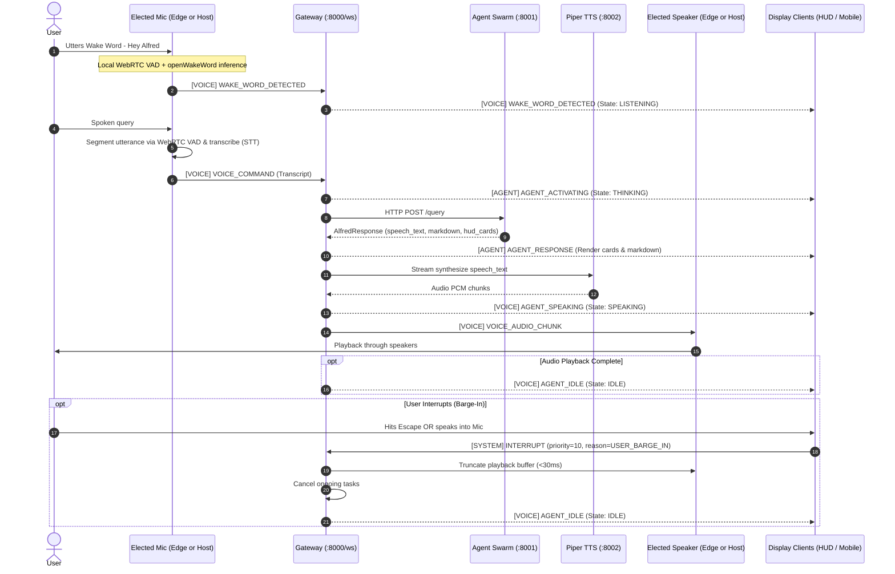
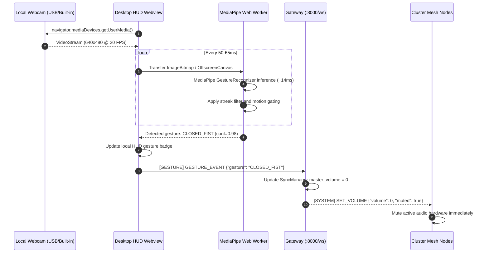
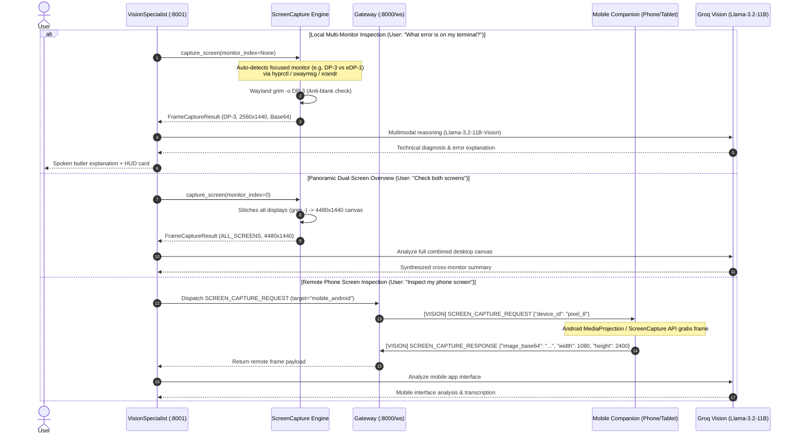
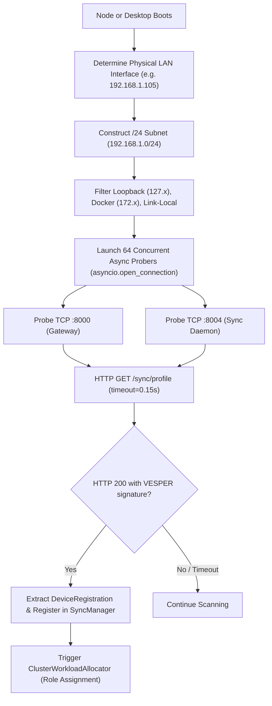

# VESPER Master Service Connectivity & Communication Specification

## 1. Executive Summary

This document is the definitive architectural specification for inter-service and cross-device communication across the **VESPER** ecosystem. It specifies the transport protocols, message envelopes, lifecycle state machines, hardware role allocations, security boundaries, and fault-tolerance guarantees connecting the Workstation, Edge SBCs, Mobile Companions, and Desktop HUD.

---

## 2. Distributed Node Topology & Responsibilities

The VESPER mesh operates as a coordinated star-and-relay topology with the **VESPER Gateway (:8000)** serving as the central multiplexed hub.

```
┌──────────────────────────────────────────────────────────────────────────────────────────────────────────────────┐
│                                             VESPER GATEWAY (:8000/ws)                                            │
│                                       Single-Pipe Multiplexed WebSocket Hub                                      │
├────────────────────────────────┬────────────────────────────────────────┬────────────────────────────────────────┤
│      DESKTOP HUD (Tauri v2)    │        EDGE SBC (Orange Pi / Jetson)   │         MOBILE PHONE COMPANION         │
│     (Workstation / Monitor)    │           (Stationary Desk Node)       │          (Android / iOS Phone)         │
├────────────────────────────────┼────────────────────────────────────────┼────────────────────────────────────────┤
│ - MediaPipe Web Worker (CV)    │ - USB Mic Array (openWakeWord + VAD)   │ - NotificationListenerService (Android)│
│ - Local Webcam 15-20 FPS       │ - USB / 3.5mm Powered Desk Speakers    │ - Priority Alert Filtering & Relay     │
│ - Emits discrete GESTURE_EVENT │ - Runs low-power audio loops (<0.5%CPU)│ - EventKit Calendar / Reminders (iOS)  │
│ - Ambient Agent State Core     │ - SyncClient hardware telemetry probe  │ - Mobile HUD & Quick Voice Capture     │
│ - Glanceable Cards & Dialog    │ - Headless, silent operation           │ - Connects via WiFi or Tailscale VPN   │
│ - System Tray & Global Hotkeys │ - No heavy LLM or CV processing        │ - Persistent foreground service        │
└────────────────────────────────┴────────────────────────────────────────┴────────────────────────────────────────┘
```

---

## 3. Communication Matrix

| Source Node | Destination Node | Transport Protocol | Port / Endpoint | Payload Type | Latency Target |
| :--- | :--- | :--- | :--- | :--- | :--- |
| **Any Client** | Gateway | Persistent WebSocket | `ws://<gw_ip>:8000/ws` | Multiplexed Universal Envelope (JSON) | <10ms (LAN) |
| **Gateway** | Agent Swarm | HTTP/1.1 REST (Keepalive) | `http://127.0.0.1:8001/query` | Structured Query & Context (JSON) | <1500ms (LLM) |
| **Gateway** | Voice Subsystem | HTTP/1.1 REST / Async Gen | `http://127.0.0.1:8002/tts` | Text Input -> Audio PCM/WAV Chunks | <150ms TTFS |
| **Gateway** | Cluster Sync | Internal / HTTP REST | `http://127.0.0.1:8004/sync` | Hardware Profiles, State Diffs | <50ms |
| **Desktop / Node**| Local Subnet | Concurrent Async TCP Sweep | Ports `8000` & `8004` (`/24`) | HTTP `GET /sync/profile` (Probe) | <1.0s total |
| **Desktop Webview**| Web Worker | Browser Worker PostMessage | Client Memory Channel | Transferable ArrayBuffer / ImageBitmap | <14ms |
| **Mobile Client**| Gateway (Remote) | WebSocket over WireGuard | Tailscale Overlay IP | Encrypted Universal Envelope (JSON) | <60ms (WAN) |

---

## 4. Universal Message Envelope Specification

All WebSocket frames transmitted over `/ws` conform to the strict Pydantic envelope defined in `backend/shared/events.py`:

```json
{
  "uuid": "4c9d5e78-9a21-4f88-b21a-6e11894d0e12",
  "channel": "VOICE",
  "type": "VOICE_COMMAND",
  "status": "ok",
  "timestamp": 1772710800.125,
  "source": "desk-hud-01",
  "payload": {
    "command": "What is the status of my cluster?",
    "is_final": true,
    "confidence": 1.0
  }
}
```

### 4.1 Multiplexed Channels
1. **`CONTROL`**: Handshakes (`CLIENT_HELLO`, `SERVER_HELLO`), heartbeat telemetry (`PING`, `PONG`), and error envelopes.
2. **`VOICE`**: Voice transcripts, wake word signals, and speech lifecycle states (`WAKE_WORD_DETECTED`, `VOICE_COMMAND`, `AGENT_SPEAKING`, `AGENT_IDLE`).
3. **`AGENT`**: Cognitive swarm reasoning telemetry (`AGENT_ACTIVATING`, `AGENT_RESPONSE`).
4. **`GESTURE`**: Discrete touchless vision shortcuts (`GESTURE_EVENT`, `GESTURE_TOGGLE`).
5. **`SYSTEM`**: Volume adjustments (`SET_VOLUME`), Zen mode (`ZEN_MODE_STATE`), Focus mode (`FOCUS_MODE_STATE`), media actions (`MEDIA_CONTROL`), and out-of-band barge-in (`INTERRUPT`).
6. **`NOTIFY`**: Mobile notification relays (`NOTIFICATION_RELAY`) and structured summaries (`NOTIFICATION_DIGEST`).
7. **`SYNC`**: Cross-device cluster hardware profiles and state snapshots (`STATE_SYNC`, `DEVICE_REGISTER`, `DEVICE_HEARTBEAT`).
8. **`VISION`**: Remote screen capture requests (`SCREEN_CAPTURE_REQUEST`), remote display frame responses (`SCREEN_CAPTURE_RESPONSE`), and optical camera frame streams (`CAMERA_FRAME_STREAM`).

---

## 5. End-to-End Event Lifecycles

### 5.1 Voice Interaction Pipeline & State Machine



### 5.2 Hand Gesture Pipeline (Client-Side Web Worker)



### 5.3 Multi-Monitor Local Capture & Remote Device Vision Pipeline

VESPER supports local multi-monitor setups (eDP laptop panels, DisplayPort/HDMI monitors) and remote cluster devices (smartphones, tablets, edge nodes) via a unified perception architecture:



---

## 6. Device Discovery: Active TCP Subnet Sweep Protocol

VESPER deliberately avoids UDP multicast and mDNS due to frequent packet drops on enterprise APs, campus networks, and mobile OS sleep sandboxes.



---

## 7. Workload Allocation (Least-Capability Principle)

The cluster allocator (`backend/sync/cluster_allocator.py`) continuously computes a Capability Score for every discovered node:

$$\text{CapScore} = (\text{RAM}_{\text{total}} \times 2.0) + (\text{RAM}_{\text{available}} \times 3.0) + (\text{Cores} \times 1.5) + \text{DeviceTypeWeight}$$

### Role Mapping Rules:
1. **`ROLE_AUDIO_CAPTURE` (Microphone)**:
   - Assigned to the least-capable dedicated edge listener (e.g., Orange Pi Zero 3) with an active mic array to keep high-power workstations cool and idle.
2. **`ROLE_AUDIO_PLAYBACK` (Speakers)**:
   - Assigned to the device with dedicated external speakers (e.g., Orange Pi connected to desktop studio monitors, or host workstation with hi-fi audio).
   - If the assigned node disconnects, the Gateway automatically fails over to the host workstation's internal speakers.
3. **`ROLE_VISION_PERCEPTION` (Webcam Gestures)**:
   - Assigned strictly to the device with the active optical camera facing the user (Desktop HUD on workstation monitor).
   - Processed locally in a Web Worker; zero raw video crosses the network.
4. **`ROLE_COGNITIVE_SWARM` (LangGraph & LLM Supervisor)**:
   - Assigned exclusively to nodes with $\ge 4.0\text{ GB}$ RAM and $\ge 2$ CPU cores with $<88\%$ load.
5. **`ROLE_HUD_DISPLAY`**:
   - Assigned to all interactive monitor and mobile screen devices (`DESK_HUD`, `MOBILE_ANDROID`, `MOBILE_IOS`).

---

## 8. Potential Distributed Gaps & Resolved Solutions

### 8.1 Network Security & Cluster Authentication
- **Requirement**: Prevent rogue devices on public/shared WiFi from injecting commands or spoofing hardware roles.
- **Solution**:
  - A pre-shared cluster key (`VESPER_CLUSTER_KEY`) is stored in `backend/.env`.
  - During `CLIENT_HELLO`, client sends an HMAC-SHA256 signature or shared token in the payload.
  - Handshake is rejected with HTTP 4003 if the token is invalid or missing.

### 8.2 Audio Chunk Streaming Format over WebSocket
- **Requirement**: Stream real-time synthesized speech chunks from Gateway to the elected speaker node with low latency.
- **Solution**:
  - Audio chunks are transmitted in 16-bit PCM 22050Hz mono format (`VOICE_AUDIO_CHUNK`).
  - At 22050Hz, bandwidth is ~44.1 KB/s, completely negligible on 100Mbps/1Gbps LANs.
  - Speaker node feeds chunks directly to ALSA/PipeWire/PulseAudio sink buffer without transcoding.

### 8.3 State Conflict Resolution & Concurrency
- **Requirement**: Prevent race conditions when multiple devices update state simultaneously (e.g. Volume slider on phone vs. pinch dial on desktop).
- **Solution**:
  - `SyncManager` maintains a monotonic state version sequence number (`state_version`).
  - Last-write-wins (LWW) with server-authoritative timestamps is enforced.
  - Updates are broadcast as atomic diffs rather than full state overwrites.

### 8.4 Mobile Background Execution & OS Sandboxing
- **Requirement**: Mobile operating systems (Android Doze, iOS background app limits) aggressively terminate idle WebSocket connections.
- **Solution**:
  - **Android**: An active Foreground Service with an ongoing notification (`VESPER Cluster Link`) holds a background wake lock and WebSocket connection.
  - **iOS**: Uses background push notification alerts or connects upon foregrounding; full WebSocket links are active when the app is on screen.
  - **Reconnection**: Exponential backoff reconnects automatically on network resume (<1.5s).

### 8.5 Out-of-Band Precedence Arbitration
- **Requirement**: Avoid audio conflicts when a user speaks while Alfred is playing speech or when a proactive alert arrives.
- **Solution**:
  - **User Barge-In (Priority 10)**: Truncates audio buffers immediately (<30ms) and cancels running backend tasks.
  - **Proactive / Digest Alerts (Priority 1-4)**: Deferred if user is currently speaking or if Alfred is actively reasoning. Queued silently until cluster returns to `IDLE`.

---

## 9. Verification Standards

All communication components are strictly verified by unit tests:
1. `backend/tests/test_gateway.py`: Handshake, channel multiplexing, voice roundtrip, wake word broadcast, gesture broadcast, out-of-band barge-in.
2. `backend/tests/test_terminal_services.py`: Subprocess supervisor boot, health endpoints, 18-second keepalive ping/pong, and clean shutdown.
3. `backend/tests/test_network_scanner.py`: Async TCP subnet sweep, concurrency limits, timeout handling, and device profile extraction.
4. `backend/tests/test_cluster_allocator.py`: Least-capability score calculation, speaker selection, camera selection, and failover routing.
5. `backend/tests/test_vision.py`: Wayland multi-monitor discovery, blank frame detection, Groq multimodal reasoning, and gesture streak state machines.

---

## 10. Client Applications Connection & Communication Manual

This section defines the exact implementation rules for connecting client applications to the VESPER cluster.

### 10.1 Desktop HUD Application (Tauri v2 + React 19 + TypeScript)

#### Connection Flow:
1. **Host Boot**: The Tauri core launches and opens `ws://127.0.0.1:8000/ws`.
2. **Handshake**: Emits `CLIENT_HELLO` within 5000ms:
   ```json
   {
     "channel": "CONTROL",
     "type": "CLIENT_HELLO",
     "payload": {
       "client_id": "tauri_desktop_hud_primary",
       "client_type": "DESK_HUD",
       "version": "2.0.0",
       "capabilities": ["display", "webcam_gestures", "audio_playback", "system_control"]
     }
   }
   ```
3. **Gateway Response**: Gateway replies with `SERVER_HELLO`, assigning a unique session ID and sending the current `STATE_SNAPSHOT`.
4. **Vision & Gestures**:
   - For UI video playback: Mounts `` (cross-origin anonymous omitted to avoid WebKitGTK CORS preflight locks).
   - For MediaPipe Gesture Tracking: Fetches discrete frames from `http://127.0.0.1:8000/api/camera/snapshot` via `fetch() -> res.blob() -> createImageBitmap(blob)`.
   - Runs WebGL2 canvas context on the main thread using UMD `vision_wasm_internal.js` (avoids WebKitGTK worker context crashes and `import.meta` syntax errors).
   - Geometric classification fallback evaluates landmark angles and extensions (`classifyLandmarkGeometry`).
   - Emits detected gestures over `Channel.GESTURE` as `GESTURE_EVENT`.
5. **Wake Word Control**:
   - Displays `Wake Word: [ARMED / MUTED]` button in `CameraDrawer.tsx`.
   - Toggles state by sending `WAKE_WORD_TOGGLE` on `Channel.VOICE`.

---

### 10.2 Mobile Phone Companion (Android Kotlin / iOS Swift)

#### Connection Flow:
1. **Subnet Auto-Discovery**:
   - Mobile app connects to home/office WiFi.
   - Conducts async TCP sweep over local `/24` subnet on port `8000`, probing `GET http://<ip>:8000/health`.
   - Falls back to configured Tailscale VPN IP (e.g. `100.x.y.z:8000`) when operating outside the local network.
2. **Registration & Capability Enrollment**:
   - Emits `CLIENT_HELLO` with `client_type: "MOBILE_ANDROID"` or `"MOBILE_IOS"`.
   - Sends `DEVICE_REGISTER` on `Channel.SYNC`:
     ```json
     {
       "channel": "SYNC",
       "type": "DEVICE_REGISTER",
       "payload": {
         "device_id": "pixel_8_pro_user",
         "device_type": "mobile_android",
         "device_name": "Pixel 8 Pro",
         "has_display": true,
         "has_camera": true,
         "has_microphone": true,
         "screen_resolution": [1080, 2400],
         "battery_level": 88
       }
     }
     ```
3. **Android Notification Relay**:
   - Implements Android `NotificationListenerService`.
   - When a phone notification is posted, extracts app package, title, and body.
   - Forwards to Gateway on `Channel.NOTIFY` as `NOTIFICATION_RELAY`:
     ```json
     {
       "channel": "NOTIFY",
       "type": "NOTIFICATION_RELAY",
       "payload": {
         "package_name": "com.google.android.gm",
         "app_name": "Gmail",
         "title": "Flight Confirmation #AK891",
         "text": "Your flight to San Francisco is confirmed for 09:15 AM tomorrow.",
         "post_time": 1788439120.0
       }
     }
     ```
4. **Remote Screen Inspection**:
   - Listens for `SCREEN_CAPTURE_REQUEST` on `Channel.VISION`.
   - Captures screen frame via Android MediaProjection API.
   - Encodes frame as JPEG base64 and replies with `SCREEN_CAPTURE_RESPONSE`:
     ```json
     {
       "channel": "VISION",
       "type": "SCREEN_CAPTURE_RESPONSE",
       "payload": {
         "device_id": "pixel_8_pro_user",
         "image_base64": "...",
         "width": 1080,
         "height": 2400
       }
     }
     ```
5. **Background Liveness**:
   - Runs an Android Foreground Service with an ongoing notification (`VESPER Cluster Active`) to hold a partial wake lock and keep the WebSocket connection alive during device standby.

---

### 10.3 Edge SBC Nodes (Orange Pi 5 Plus / Raspberry Pi 4/5)

#### Connection Flow:
1. **Headless Boot**:
   - `systemd` unit launches `scripts/run_vesper_services.py --mode edge_sbc` at boot.
   - Connects to Gateway at `ws://<workstation_ip>:8000/ws`.
2. **Role Declaration**:
   - Emits `CLIENT_HELLO` with `client_type: "EDGE_ORANGE_PI"`.
   - `has_camera: false`, `has_microphone: true`, `has_speaker: true`.
3. **Autonomous Audio Perception**:
   - Runs `WakeWordListener` using `openWakeWord` with custom "Hey Alfred" model.
   - Operates continuous circular 16kHz PCM audio buffer (<0.5% CPU on ARM Cortex-A76).
   - When wake word threshold $\ge 0.50$ is crossed, emits `[VOICE] WAKE_WORD_DETECTED` to Gateway.
   - Runs WebRTC VAD to segment user's spoken command and streams `[VOICE] VOICE_AUDIO_CHUNK` or forwards STT text.
4. **Audio Playback Sink**:
   - Subscribes to `[VOICE] VOICE_AUDIO_CHUNK` on `Channel.VOICE`.
   - Directly feeds 22050Hz 16-bit mono PCM chunks into local ALSA / PulseAudio hardware sink.
   - Truncates buffer in $<30\text{ms}$ upon receiving `[SYSTEM] INTERRUPT`.

---

### 10.4 Web / Tablet Desk HUD (Browser Companion)

#### Connection Flow:
1. Connects to `http://<gateway_ip>:8000` from Safari on iPad or Chrome on Android tablet.
2. Establishes `/ws` session with `client_type: "DESK_HUD"`.
3. Renders full-screen ambient dashboard:
   - Live speech transcript & Butler conversational cards.
   - Dynamic audio visualizer reacting to `AGENT_SPEAKING` events.
   - Real-time synchronized master volume dial and Zen mode toggle.
   - Interactive touch cards for calendar events, task lists, and system vitals.
