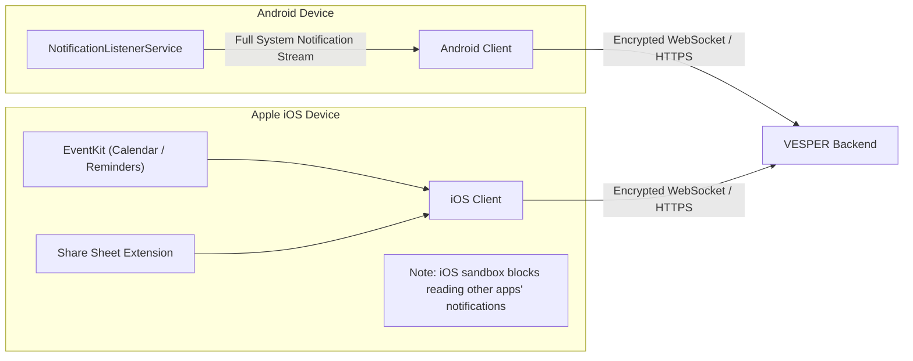
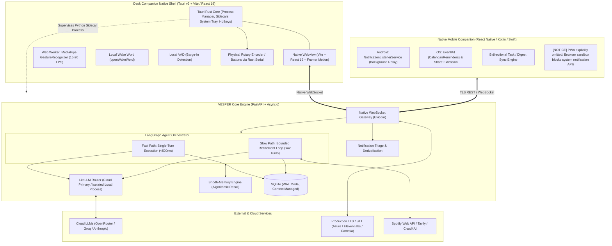
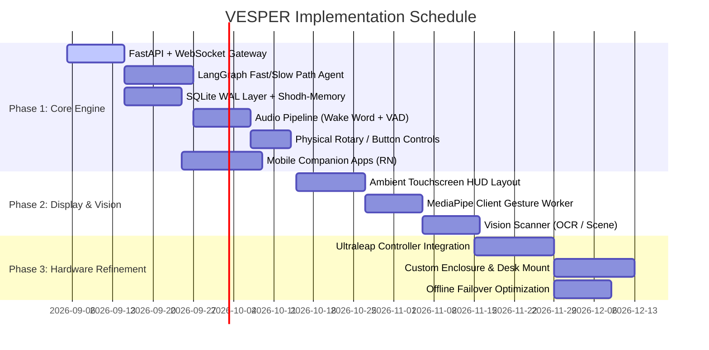

# Project Specification: Desk Companion Assistant
**Working Title**: VESPER *(ReflectOS v2)*

---

## 1. Executive Summary & Vision

**VESPER** is an AI-orchestrated, always-on personal desk companion. Positioned beside the user at their workspace, it acts as an intelligent, voice-first ambient assistant. It listens for a wake word, processes voice commands, displays glanceable information, and relays prioritized mobile notifications—enabling immediate assistance without derailing deep work.

### Origin & Evolution
The project originated as **ReflectOS**, a whole-room, gesture-driven smart-mirror HUD. Extensive prototyping and technical auditing revealed that:
1. Full-body/expressive gestures across a room are tiring, unnatural for daily workflow, and prone to high CPU/WASM overhead and tracking jitter.
2. The real-world need was for an **ambient assistant while working at a desk**, with hands frequently on a keyboard, glanceable at an angle, voice-first, with gestures reserved for quick, low-effort shortcuts.

Rather than incrementally patching the smart mirror codebase, VESPER introduces a modern, modular architecture designed from first principles for stationary desk companionship.

---

## 2. Feature Comparison: v1 vs. v2

### 2.1 Carried Forward from ReflectOS v1
| Feature | Implementation in VESPER (v2) |
|---|---|
| **Voice Assistant ("Alfred")** | Elevated to the **primary interaction channel** with full barge-in capabilities. |
| **Zen Mode** | Retained; instantly declutters the display to minimal ambient time/date. |
| **Finance Terminal** | Retained as a slow-path agent tool (accounts, expense logging, debt ledger). |
| **Media Hub** | Retained as a fast-path agent tool (Spotify Web API & YouTube playback control). |
| **Vision Scanner** | Retained as an on-demand slow-path tool (OCR, scene description, item identification). |
| **Task Manager** | Retained; upgraded with bidirectional sync to mobile companion apps. |
| **TTS Responses** | Upgraded from fragile consumer scrapers to robust, production-grade speech engines. |
| **Gesture Shortcuts** | Streamlined to a compact set of ≤5 high-reliability shortcut gestures. |

### 2.2 Descoping & Eliminations
* **Complex Two-Hand Gestures**: Deprecated (`AIR_MEASURE`, `SPREAD_ZOOM`, `WRIST_CROSS`, etc.) to eliminate tracking confusion, high CPU draw, and awkward ergonomics at a desk.
* **Gestures as Primary UI**: Replaced by voice and physical desk controls (rotary dials/buttons); gestures are now strictly shortcuts.
* **Redis Cache**: Eliminated to avoid multi-daemon operational bloat for a single-user appliance.
* **Flask + Eventlet**: Replaced with asynchronous FastAPI to fix socket heartbeats and native C-extension concurrency.

### 2.3 New Capabilities in VESPER
* **Companion Mobile App (Android & iOS)**: Notification triage, calendar/reminders sync, and mobile quick-capture syncing bi-directionally with the desk unit.
* **Ambient Glanceable Display**: Always-visible heads-up cards (time, upcoming calendar event, active tasks, notification digest).
* **Smart Notification Triage**: Notifications are batched, summarized, and filtered; only high-priority contacts interrupt in real-time.
* **Focus-Mode Awareness**: Automatic or manual suppression of non-critical interruptions during meetings or deep-work sprints.
* **Persistent Evolving Memory (Shodh-Memory)**: Algorithmic retrieval of behavioral patterns and user preferences without LLM hallucination or prompt bloating.
* **Barge-In Interruption**: Local Voice Activity Detection (VAD) instantly cuts off outgoing TTS audio when the user speaks or gestures.
* **Desk Presence Detection**: Low-power vision trigger detects user arrival or departure to toggle active/sleep display states.

---

## 3. Platform-Specific Realities & Mobile Constraints

Notification synchronization requires platform-specific architectural branches:

* **Android**: Full system notification mirroring is supported via `NotificationListenerService`. Incoming push events are sanitized, batched, and relayed to the desk unit.
* **iOS**: **Third-party apps cannot access the iOS notification stream** due to Apple's privacy sandbox. Parity is maintained by synchronizing Calendar and Reminders via `EventKit`, paired with an iOS Action/Share Extension for deliberate content capture.

---

## 4. Technical Architecture

### 4.1 Native Desktop Shell: Tauri v2 + Python Sidecar
* **Lightweight Native Wrapper**: Replaces heavy Electron or bare browser tabs. Consumes only **~30–45MB RAM** on idle.
* **Process Lifecycle Supervision**: Tauri's Rust core runs the FastAPI backend as an internal **Sidecar binary/process**, ensuring deterministic startup, health monitoring, and guaranteed termination on exit (zero orphaned Python processes).
* **Native OS Integration**:
  * **System Tray & Mini-HUD**: Sits in the Linux/Windows/macOS system tray with status indicators and quick toggle shortcuts.
  * **Borderless / Transparent HUD Window**: Native support for customizable, transparent, always-on-top, or click-through HUD layouts.
  * **Hardware & Serial Bus Access**: Direct zero-latency access to USB serial devices (e.g. Arduino/ESP32 rotary knobs or physical volume dials) via Rust `serialport`, bypassing browser security limitations.

### 4.2 Strictly Native Mobile Strategy (No PWA)
* **Rejection of PWA**: PWAs run inside browser sandboxes where access to third-party app notifications is strictly blocked by Android and iOS security models. Background WebSockets in mobile browsers are also terminated aggressively by OS battery managers (Doze mode).
* **Android Native Relay**: Implemented via a persistent Android **Foreground Service** running `NotificationListenerService`. It intercepts incoming notifications from prioritized apps (WhatsApp, Slack, Telegram, Gmail), sanitizes the payload, batches digests, and relays high-urgency pings to the desk device over WebSocket.
* **iOS Native Sync**: Integrates with Apple's `EventKit` API for bi-directional Calendar & Reminders sync, complemented by a native **iOS Share Sheet Extension** for one-tap capture from Safari or other apps.

### 4.3 Client-Side Gesture & Vision Subsystem
* **Execution Boundary**: All gesture recognition occurs **strictly client-side** in a dedicated Web Worker. Raw video frames and dense landmark meshes never cross the network.
* **Pretrained Models**: Uses MediaPipe Tasks' official `GestureRecognizer` rather than custom heuristic trigonometry.
* **Adaptive Frame Rates**:
  * Discrete gestures (e.g. `TOGGLE_ZEN_MODE`): Downsampled to **15–20 fps** to conserve thermal and compute budgets.
  * Continuous analog controls (e.g. volume dial rotation): Polled at 60 fps only while actively engaged.
* **Confirmation Streaks**: Safety interrupts use minimal confirmation frames (fast action); ambient gestures require longer streaks to prevent accidental activation.

### 4.2 Agentic Fast Path vs. Slow Path
To eliminate the 4–10 second latency of ReflectOS v1, the LangGraph workflow is bifurcated:

1. **Fast Path (Target: <500ms)**:
   * *Tasks*: Volume adjustment, playback control, task checkbox, notification dismissal, basic status queries.
   * *Flow*: Single structured-output LLM call extracts intent and parameters -> executes tool directly -> returns response. Skips validation, context enrichment, and quality evaluation loops.
2. **Slow Path (Target: 1.5–3s)**:
   * *Tasks*: Open web research, multi-account financial summaries, OCR / document reading, complex schedule resolution.
   * *Flow*: Intent classification → Guard validation → Tool invocation → Bounded quality evaluation (maximum 2 iterations) → Natural language synthesis.

### 4.3 Three-Tier Memory Architecture
Memory is partitioned into distinct tiers to prevent state explosion:
1. **Working Memory (Turn-level)**: Ephemeral LangGraph state restricted to a strict **sliding window of the last 10–15 messages**.
2. **Episodic & Behavioral Memory (Shodh-Memory)**: Non-LLM, algorithmic retrieval of user habits, facts, and preferences. Stored as concise statements (<50 words) and retrieved directly via vector/lexical matching.
3. **Structured Ground Truth**: SQLite with WAL mode for deterministic records (tasks, financial ledger, debts, notification history).

### 4.4 Production Speech Pipeline (STT / TTS)
* **Retirement of Scrapers**: `edge-tts` and consumer `SpeechRecognition` wrappers are eliminated.
* **Candidate Engines**:
  * *Cloud Primary*: Google Cloud Speech / Azure Cognitive Services / ElevenLabs.
  * *Indic / Multilingual*: Sarvam AI (`Bulbul v3` + `Saaras`) for fluid English-Hindi code-switching.
  * *Local Offline*: `faster-whisper` (INT8 quantized) running on-device for air-gapped operation.
* **Barge-In Mechanics**: Local VAD on the desk client monitors audio input. If speech is detected while TTS is playing, a hard interrupt packet is sent immediately, truncating audio playback within one buffer frame.

### 4.5 Personality Contract: "Alfred"
* **Tone**: Understated, dry, witty, efficient British butler persona.
* **Architectural Containment**:
  * Personality is **strictly confined to the response generation layer**.
  * Intent classification, routing, and tool logic operate at `temperature=0.0` without stylistic interference.
  * Response generation uses contextual gating: witty and conversational for casual interactions; terse, flat, and immediate for financial data, alerts, or during **Focus Mode**.

---

## 5. Hardware Specifications & Bill of Materials (BOM)

### 5.1 Primary Compute Evaluation

| Platform | Compute & Specs | Evaluation | Verdict |
|---|---|---|---|
| **Orange Pi PC Plus** *(Legacy)* | Quad Cortex-A7, 1GB RAM, Mali-400 GPU | 2016-era hardware; cannot run local LLM, CV, or modern audio pipelines. | [REJECTED] Repurpose solely as dumb audio peripheral if needed. |
| **Orange Pi 5 Plus** | RK3588S (8-core), 16GB RAM, 6 TOPS NPU | Good value (~$150), but Rockchip NPU SDK (RKNN) is fragile compared to CUDA. | [ALTERNATIVE] Runner-up. |
| **Nvidia Jetson Orin Nano Super** | 6-core ARM A78AE, 8GB RAM, 1024-core Ampere GPU, 67 TOPS | Mature CUDA/TensorRT stack; runs Llama-3.1 8B (Q4) at >15 tps and concurrent YOLOv8. | [SELECTED] **Recommended Primary Compute**. |

### 5.2 Sensor & Peripheral Strategy
* **Depth / Gesture Sensing**:
  * *Scanning LiDAR*: Ruled out (designed for room mapping, lacks micro-resolution for hands).
  * *RGB-D Depth Camera (Orbbec Gemini / RealSense)*: High power draw; MediaPipe does not natively consume depth maps without a custom pipeline.
  * *Ultraleap / Leap Motion Controller*: **Recommended Phase 2/3 upgrade**. Uses dedicated stereo-IR cameras with hardware-accelerated hand skeletal tracking, bypassing GPU vision overhead.
* **Audio & Peripherals**: USB connectivity across all mics and cameras to maintain complete hardware portability across SBC platforms (avoiding GPIO/CSI driver lock-in).

### 5.3 Hardware Bill of Materials (Phased)

#### Phase 1: Core Desk Build
| Item | Description / Model | Estimated Cost (USD) | Landed Cost (INR Est.) |
|---|---|:---:|:---:|
| **Compute Board** | Nvidia Jetson Orin Nano Super Dev Kit | $249 – $299 | ₹26,000 – ₹32,000 |
| **Vision Camera** | USB 1080p Webcam (Logitech C920 / Brio-class) | $70 – $130 | ₹7,000 – ₹12,000 |
| **Microphone Array** | ReSpeaker 4-Mic USB Array with hardware AEC | $60 – $70 | ₹6,500 – ₹8,000 |
| **Speaker** | Low-latency powered USB / 3.5mm desktop speaker | $20 – $40 | ₹2,000 – ₹4,000 |
| **NVMe Storage** | 512GB M.2 2280 NVMe SSD | $30 – $50 | ₹3,500 – ₹5,000 |
| **Physical Controls** | USB/GPIO rotary encoder + tactile pushbuttons | $10 – $20 | ₹1,000 – ₹2,000 |
| **Enclosure & Power** | Custom desk stand/case, USB-C PD, cabling | $30 – $50 | ₹3,000 – ₹5,000 |
| **Phase 1 Total** | | **~$470 – $660** | **~₹49,000 – ₹68,000** |

#### Phase 2: Upgrades & Displays
| Item | Description / Model | Estimated Cost (USD) |
|---|---|:---:|
| **Ambient Display** | 5" to 7" HDMI/USB-C IPS Touchscreen (1024x600 or 1280x800) | $60 – $150 |
| **Precision Gestures** | Ultraleap Stereo IR Hand Tracking Controller | $100 – $150 |
| **Battery Resilience** | Mini DC-UPS / 12V Li-ion battery backup | $35 – $60 |
| **Phase 2 Total** | | **~$195 – $360** |

---

## 6. Implementation Roadmap

---

## 7. Open Technical Decisions

1. **TTS / STT Selection Matrix**: Final benchmarking between ElevenLabs (supreme naturalness) vs. Azure Speech (lower latency & cost) vs. Sarvam (Indic code-switching).
2. **Gesture Vocabulary Freeze**: Limiting to a maximum of 5 distinct single-hand shortcuts (e.g. Mute/Barge-in, Zen Mode, Volume Dial, Next Card, Quick Capture).
3. **Leap Motion vs. WebCam**: Validating whether standard RGB webcam gesture accuracy in a Web Worker is sufficient before committing to Ultraleap hardware.
4. **Final Brand Identity**: Selecting final project moniker (**VESPER**, **PERCH**, or **NOOK**) and confirming assistant persona (**Alfred**).
